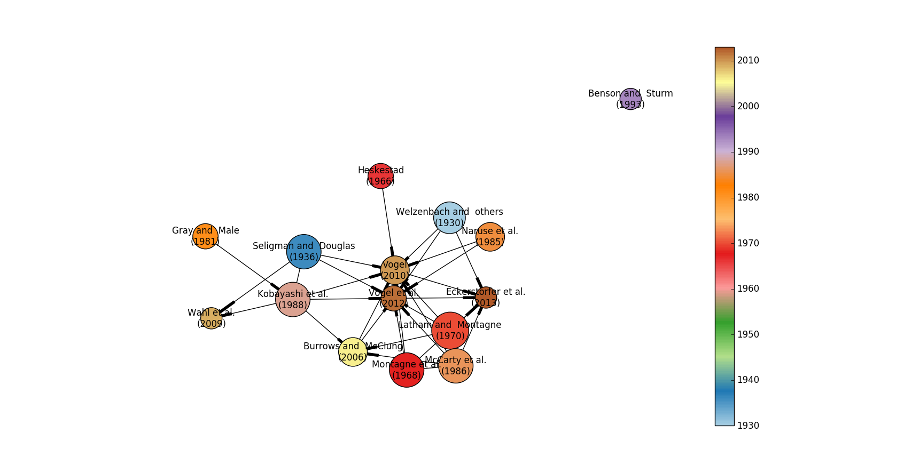

# Library to display Reference tree map

Simon Filhol, Dec 2016,
copyright under the MIT license terms, see the License.txt file

Requires Python 2.7 and libraries:
* Matplotlib
* Networkx
* Numpy
* Bibtexparser


## Goal
Map the citation relationship across a corpus of papers. 

## Idea
- Y axes should be time (year of publication/publication date)
- Use bibtex formating

## Use

1. import your citation into a file with .bib format.
2. add field 'parent' to each citation as follow: ```parent={seligman1936snow, gray1981handbook}, ```
3. manually edit parents for each paper. WARNINGS: spelling must be accurate 
4. run python script pointing at your bib file to plot or extract further information

See Example files in the directory /example

## Example
Custom bib file extract:
```bib
@article{kobayashi1988formation,
  title={Formation process and direction distribution of snow cornices},
  author={Kobayashi, Daiji and Ishikawa, Nobuyoshi and Nishio, Fumihiko},
  journal={Cold Regions Science and Technology},
  volume={15},
  number={2},
  pages={131--136},
  year={1988},
  publisher={Elsevier},
  parent={seligman1936snow, gray1981handbook},
  owncopy={yes}
}

@article{benson1993structure,
  title={Structure and wind transport of seasonal snow on the Arctic slope of Alaska},
  author={Benson, Carl S and Sturm, Matthew},
  journal={Annals of Glaciology},
  volume={18},
  number={1},
  pages={261--267},
  year={1993},
  publisher={International Glaciological Society},
  owncopy={yes}
}

@inproceedings{mccarty1986cornices,
  title={Cornices: their growth, properties, and control},
  author={McCarty, D and Brown, RL and Montagne, John},
  booktitle={International Snow Science Workshop, Lake Tahoe},
  pages={41--45},
  year={1986},
  parent={latham1970possible, montagne1968nature},
  owncopy={yes}
}
```
Plot generated from bib file:


## Resources:
http://networkx.readthedocs.io/en/networkx-1.11/index.html

Other:
- http://www.openbookproject.net/thinkcs/python/english2e/ch21.html
- http://stackoverflow.com/questions/7020741/drawing-rendering-multiway-tree-in-python
- http://stackoverflow.com/questions/14527011/python-library-for-creating-tree-graphs-out-of-nested-python-objects-dicts
- http://stackoverflow.com/questions/11479624/is-there-a-way-to-guarantee-hierarchical-output-from-networkx

## Keywords
mapping, citation, network, publication, tree
